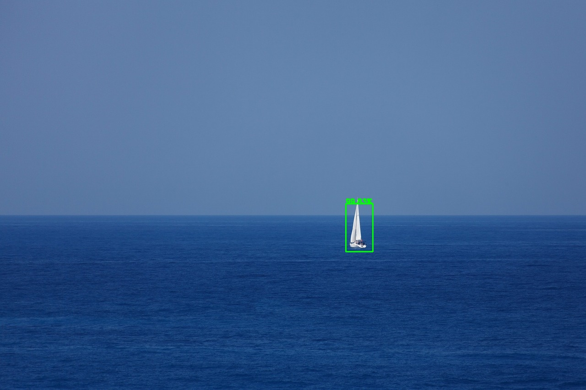
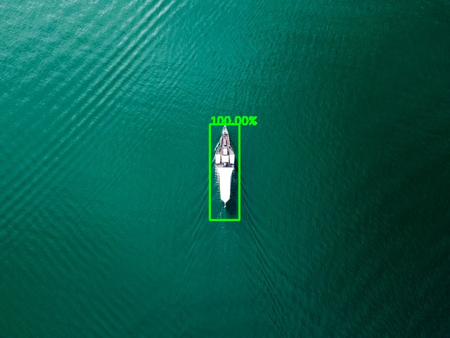
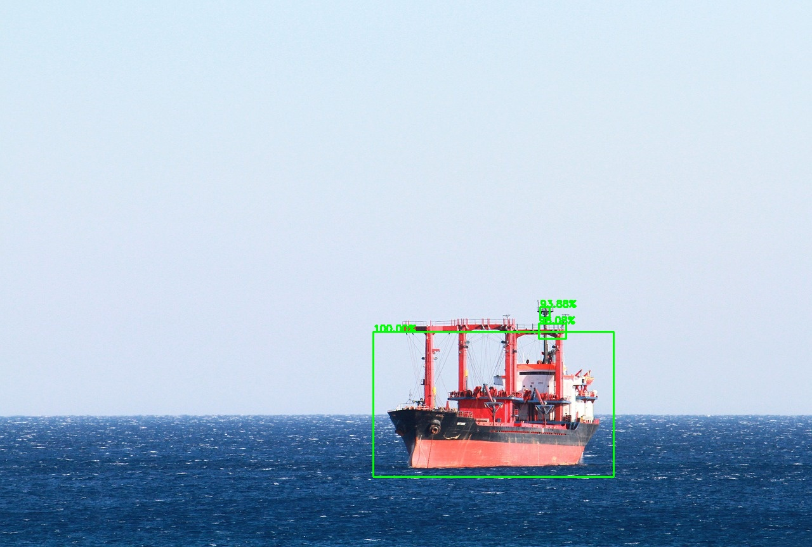
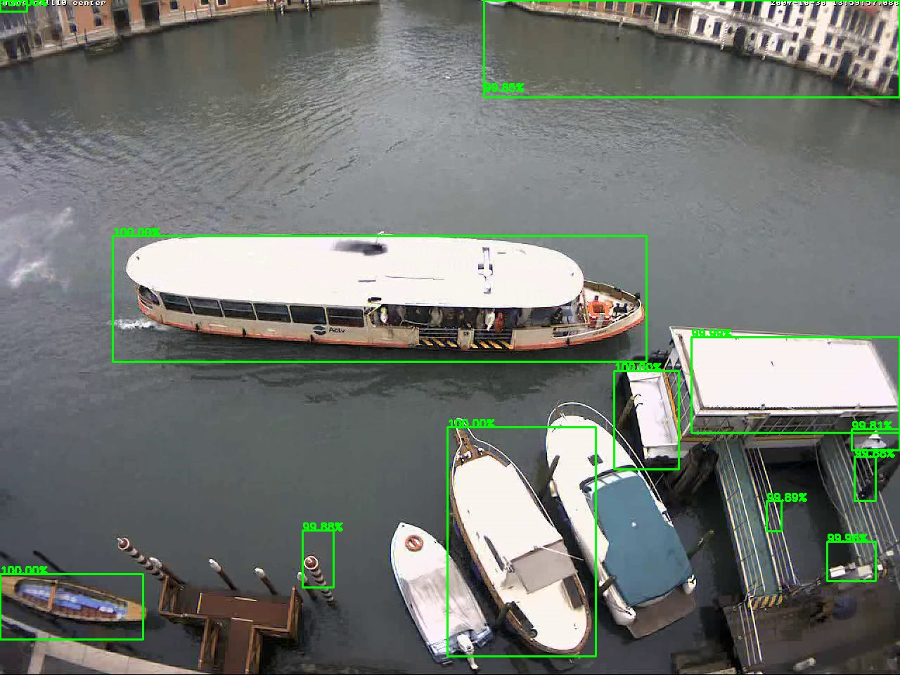
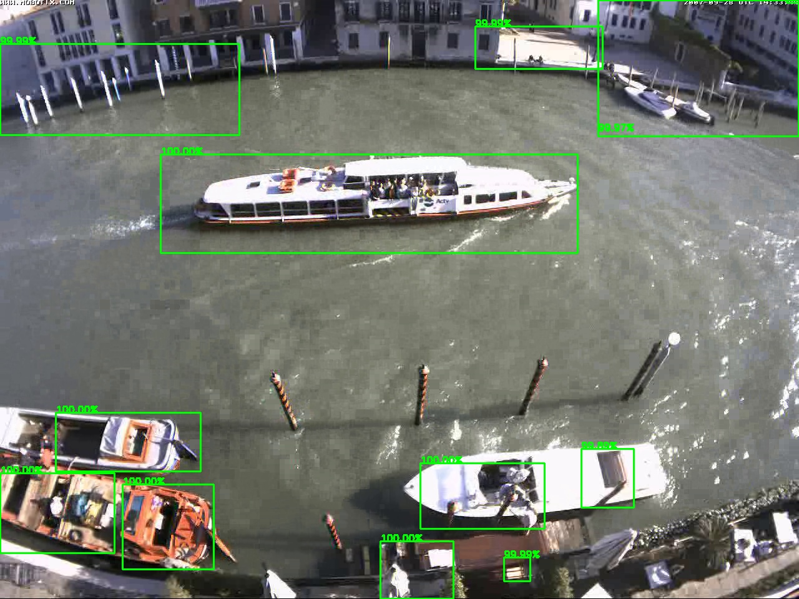
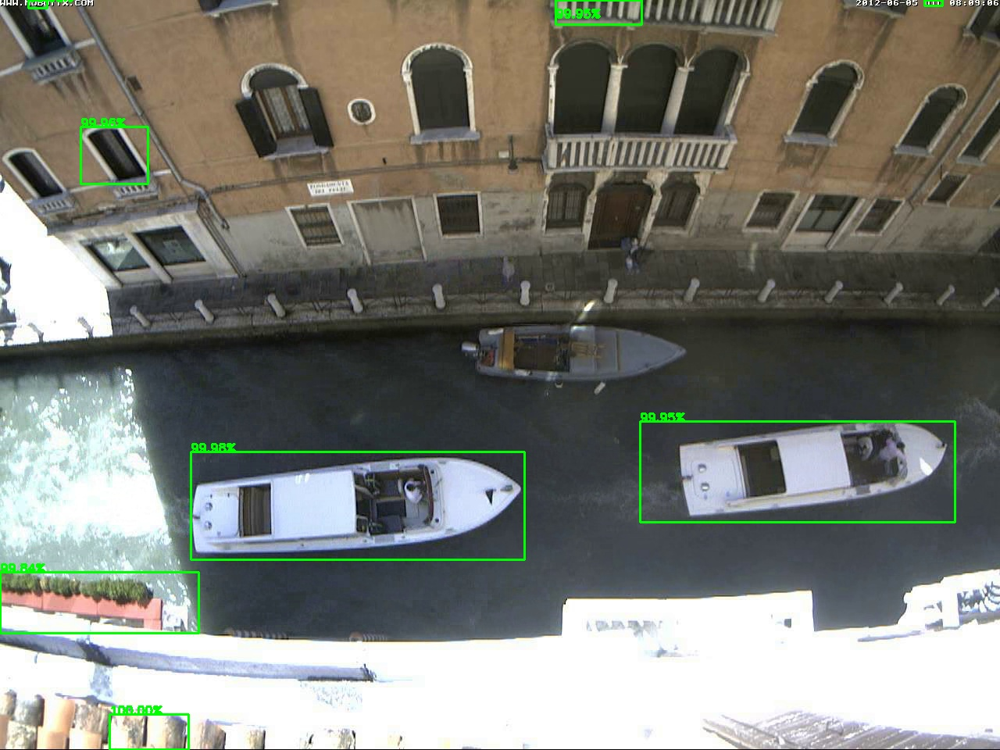

# Boat detection

This project focuses on detecting boats with different points of view, sizes, shapes, types, background elements and illumination conditions.  
The main project directory is __'src_cpp'__ where a CMakeLists.txt file is used to build the application. The **main.cpp** file implements the proposed approach on a given input image, while in the subdirectory __'utils'__ there are all the files needed in order to do so.
In the folder __'src_python'__ there is instead a jupyter notebook which shows all the pipeline followed for traning the CNN classifier that will be used in the C++ application. To transfer the model from TensorFlow to OpenCV dnn module, directory __'my_model'__ and file frozen_graph.pb are needed. Especially the last one is the file used in OpenCV for loading the net configuration.

## Brief description

The boat detection algorithm here implemented uses selective search as region proposal method to find possible locations of boats in an image, moreover a CNN made by scratch is used to classify the bounding boxes mentioned before. Then a pre and post processing phases are also added.  

The main steps are:  
    1. Read an input image;  
    2. Apply a median and bilateral filter;  
    3. Use Selective Search ("fast mode") to the filtered image for generate regions proposal;  
    4. Discard all regions that have the ratio between height and width (or vice versa) bellow a given threshold;  
    5. Each region proposal represent a patch from the original image that will be resized and classified thanks a CNN;  
    6. Apply Non-Maximum Suppression (NMS);  
    
The final results are quite nice for some input images like:   

   

while in photo with a complex background, the detection is more challenging:   

  

For further details look at the report: _'report/report_boat_detection.pdf'_

## Basic Usage

**src_cpp/main.cpp**  

In the first modality the application produces in output the image with green bounding boxes for all regions with boats. Above each box a score is present and represent the probability of that region to be a boat. As command line argument, give only the image path:

<code> image_path </code>  

For example:
    01.jpg

In the second modality in addition of what happens for the first one, in output is also produces the comaprison with the ground truth (Note: the assumption is that the ground truth is stored with same format as in [dataset]( https://drive.google.com/file/d/1XkVfXNjq_KMANKUBSlbpPrlMNe9cMhKk/view?usp=sharing), for example **boat:264;371;342;362;**). As command line arguments, give the image path and ground truth path (**.txt file**):

<code> image_path     ground_truth_path </code>  

For example:
    01.jpg 01.txt

Note: Depending on the image, the computation may require some moments.
